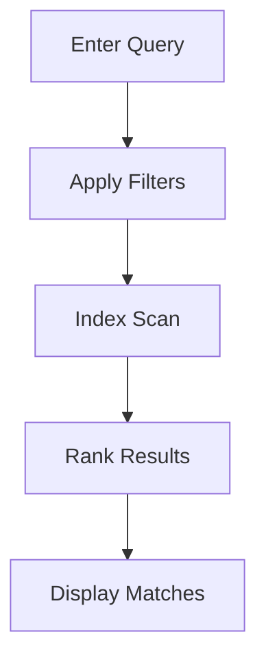

## Overview

jls provides powerful tools to manage your project documentation efficiently. You organize content into folders, collaborate with teams, track changes through version history, and find information quickly with advanced search features. These core capabilities help you maintain structured, up-to-date docs.

<Columns cols={2}>
  <Card title="Organize Folders" icon="folder" href="#document-organization">
    Structure your docs hierarchically for easy navigation.
  </Card>
  <Card title="Collaborate Seamlessly" icon="users" href="#collaboration">
    Share and edit docs with your team in real time.
  </Card>
  <Card title="Track Versions" icon="git-branch" href="#version-history">
    Review and revert changes with full history.
  </Card>
  <Card title="Search Smartly" icon="search" href="#search-filtering">
    Find content instantly with filters and queries.
  </Card>
</Columns>

## Document Organization and Folders

Create a clear hierarchy for your documentation using folders. You nest pages within folders to mirror your project's structure, such as `/api/reference` or `/guides/onboarding`.

<Steps>
  <Step title="Create a Folder" icon="folder-plus">
    Navigate to your workspace and select **New Folder**. Name it descriptively, like `API Docs`.
  </Step>
  <Step title="Add Pages" icon="file-plus">
    Inside the folder, create new pages or drag existing ones. Use the sidebar to reorder.
  </Step>
  <Step title="Nest Deeper" icon="folder">
    Repeat to build subfolders, ensuring intuitive paths like `API Docs/reference/endpoints`.
  </Step>
</Steps>

<Callout kind="tip">
  Limit nesting to three levels to avoid deep navigation issues.
</Callout>

## Collaboration and Sharing Options

Invite team members and share docs securely. jls supports role-based access, public links, and integrations.

<Tabs>
  <Tab title="Team Invites" icon="users">
    Add collaborators via email. Assign roles like **Editor** or **Viewer**.

    ```javascript
    // Using jls JavaScript SDK
    import { jls } from '@jls/sdk';

    await jls.users.invite({
      email: 'team@company.com',
      role: 'editor',
      workspaceId: 'ws_123'
    });
    ```
  </Tab>
  <Tab title="Public Links" icon="link">
    Generate shareable links with optional passwords.

    <Image
      src="https://example.com/share-link.png"
      alt="Generating a public share link in jls"
      width="600"
      height="400"
    />
  </Tab>
  <Tab title="Embed Docs" icon="code">
    Embed pages in your site or Notion.

    ```html
    <iframe src="https://docs.jls.com/embed/ws_123/page-abc" width="100%" height="600"></iframe>
    ```
  </Tab>
</Tabs>

## Version History and Editing

Every edit creates a version snapshot. You review diffs, restore previous states, or branch for experiments.

<Expandable title="View and Restore Versions" default-open="true">
  Click the **History** icon on any page. Select a version to compare changes side-by-side.

  ```javascript
  // Fetch version history via API
  const history = await fetch('https://api.example.com/v1/docs/ws_123/history', {
    headers: { Authorization: `Bearer ${YOUR_API_KEY}` }
  }).then(res => res.json());

  // Restore a version
  await fetch(`https://api.example.com/v1/docs/ws_123/restore/${history[0].id}`, {
    method: 'POST',
    headers: { Authorization: `Bearer ${YOUR_API_KEY}` }
  });
  ```
</Expandable>

<Callout kind="info">
  Versions are retained for 90 days on free plans; upgrade for unlimited history.
</Callout>

## Search and Filtering Tools

Search across all docs with full-text queries, filters by folder, tag, or date. Advanced users leverage API search.

<CodeGroup tabs="JavaScript,Python">
  ```javascript
  // Search docs
  const results = await jls.search.query({
    query: 'authentication',
    filters: { folder: 'API Docs', updatedAfter: '2024-01-01' }
  });
  console.log(results);
  ```
  ```python
  # Search via Python client
  from jls import Client
  client = Client(api_key="YOUR_API_KEY")
  results = client.search("authentication", filters={"folder": "API Docs"})
  print(results)
  ```
</CodeGroup>

| Filter Type | Example | Description |
|-------------|---------|-------------|
| Folder | `folder:API` | Limit to specific folders |
| Tag | `tag:core` | Match document tags |
| Date | `updated>2024-01-01` | Recent changes only |
| User | `author:john@example.com` | Content by specific user |



These features empower you to manage documentation at scale. Start organizing your first folder today.