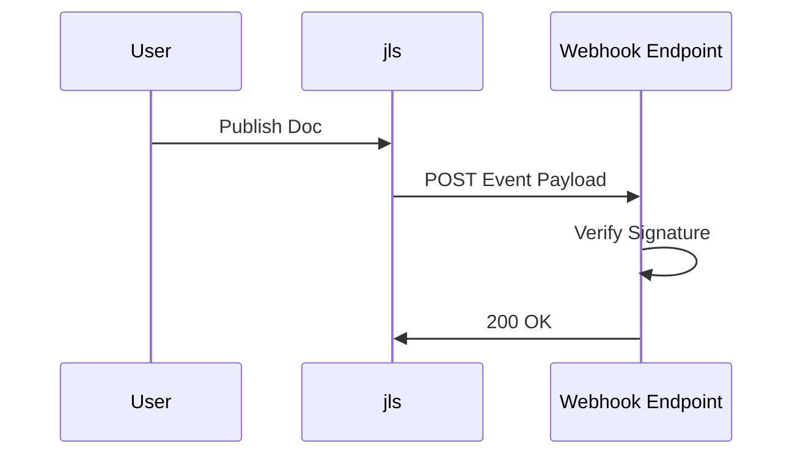

## Overview

Connect jls to your favorite tools to automate workflows, sync content, and extend functionality. jls supports webhooks for real-time updates, embeds for external content, and exports to popular formats like PDF and Markdown.

<Columns cols={3}>
  <Card title="GitHub" icon="github" href="https://github.com">
    Sync documentation changes with repository updates.
  </Card>
  <Card title="Slack" icon="message-circle" href="https://slack.com">
    Receive notifications for doc publishes and reviews.
  </Card>
  <Card title="Zapier" icon="zap" href="https://zapier.com">
    Build no-code automations with 5000+ apps.
  </Card>
</Columns>

## Supported Third-Party Integrations

jls integrates seamlessly with development and collaboration tools. Use GitHub Actions to trigger builds on doc updates, Slack for team alerts, or Zapier for custom workflows.

| Integration | Use Case | Setup Time |
|-------------|----------|------------|
| GitHub     | CI/CD pipelines | `<5` minutes |
| Slack      | Notifications   | `<2` minutes |
| Zapier     | Automations     | `<10` minutes |
| Notion     | Content import  | `<15` minutes |

<Callout kind="tip">
  Start with webhooks for most integrations—they provide real-time data without polling.
</Callout>

## Setting Up Webhooks

Webhooks notify external services of events like document publishes or comments. Configure them in your jls dashboard.

<Steps>
  <Step title="Navigate to Integrations" icon="settings">
    Go to your project settings and select the `{@integrations}` tab.
  </Step>
  <Step title="Create Webhook" icon="plus">
    Click `{@new-webhook}` and enter your endpoint URL, like `https://your-webhook-url.com/jls-events`.
  </Step>
  <Step title="Select Events" icon="list">
    Choose events such as `{@doc.published}` or `{@comment.added}`.
  </Step>
  <Step title="Verify Setup" icon="check-circle">
    Test the webhook with the `{@send-test}` button.
  </Step>
</Steps>

Verify incoming payloads match this structure:

<CodeGroup tabs="JavaScript,Python">
  ```javascript
  {
    "event": "doc.published",
    "project_id": "proj_123abc",
    "doc_id": "doc_xyz789",
    "timestamp": "2024-01-15T10:30:00Z",
    "payload": {
      "title": "API Reference",
      "url": "https://docs.example.com/api"
    }
  }
  ```
  ```python
  {
      "event": "doc.published",
      "project_id": "proj_123abc",
      "doc_id": "doc_xyz789",
      "timestamp": "2024-01-15T10:30:00Z",
      "payload": {
          "title": "API Reference",
          "url": "https://docs.example.com/api"
      }
  }
  ```
</CodeGroup>

<ParamField header="X-JLS-Signature" param-type="string" required="true">
  HMAC SHA-256 signature using your webhook secret. Verify to prevent replay attacks.
</ParamField>

## Embedding External Content

Embed third-party content directly into jls docs for richer experiences.

<Tabs>
  <Tab title="Iframe Embed" icon="layout">
    Use secure iframes for dashboards or tools.

````html
<iframe
  src="https://dashboard.example.com/embed/123"
  width="100%"
  height="400"
  frameborder="0">
</iframe>
````

    Add this to your MDX content block.
  </Tab>
  <Tab title="API-Powered Embed" icon="database">
    Fetch dynamic data via jls API.

````jsx
async function EmbedChart() {
  const response = await fetch('https://api.example.com/v1/projects/proj_123abc/charts/recent', {
    headers: {
      'Authorization': 'Bearer YOUR_API_KEY'
    }
  });
  const data = await response.json();
  return <Chart data={data} />;
}
````

    Customize with React components.
  </Tab>
</Tabs>

<Callout kind="alert">
  Always validate embedded content origins to avoid security risks.
</Callout>

## Exporting Documentation to Other Formats

Export your jls docs to PDF, HTML, or Markdown for sharing outside the platform.

```bash
curl -X POST "https://api.example.com/v1/projects/proj_123abc/export" \
  -H "Authorization: Bearer YOUR_API_KEY" \
  -H "Content-Type: application/json" \
  -d '{
    "format": "pdf",
    "include_private": false
  }'
```

<CodeGroup tabs="PDF,Markdown">
  ```json
  {
    "format": "pdf",
    "pages": ["introduction", "quickstart"],
    "theme": "default"
  }
  ```
  ```json
  {
    "format": "markdown",
    "strip_images": true,
    "output_zip": true
  }
  ```
</CodeGroup>

## Next Steps

<Columns cols={2}>
  <Card title="Webhook Security" icon="shield" href="#setting-up-webhooks">
    Learn advanced verification techniques.
  </Card>
  <Card title="Custom Integrations" icon="code">
    Build your own using the full API.
  </Card>
</Columns>

